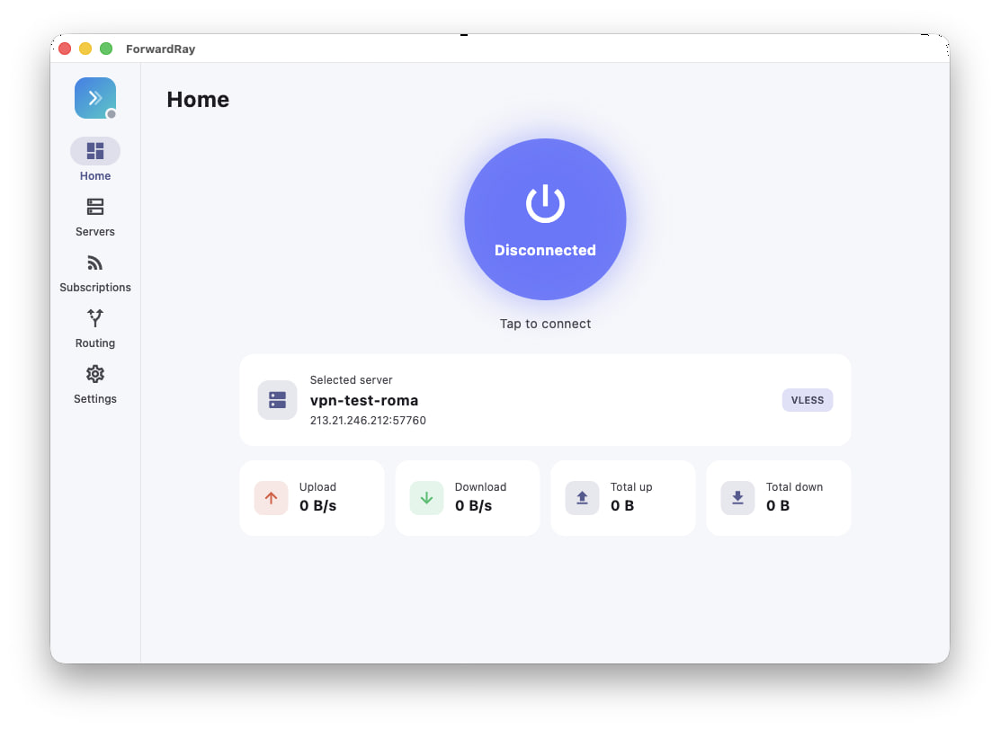

<div align="center">

# ForwardRay

**A simple, beautiful v2ray / sing-box client for Windows & macOS.**

Built with Flutter. Powered by [sing-box](https://github.com/SagerNet/sing-box).




</div>

---

## ✨ Highlights

- **Zero setup.** On first launch ForwardRay downloads the sing-box core automatically — just open and connect.
- **One-tap connect** with live up/down speed and total traffic.
- **Import anything** — `vless://`, `vmess://`, `trojan://`, `ss://` links and base64 **subscriptions**.
- **Modern protocols** — VLESS / Reality, VMess, Trojan, Shadowsocks; tcp / ws / grpc / http(upgrade) transports; TLS + uTLS fingerprinting.
- **Smart routing** — Global / Rule-based / Direct, bypass LAN, block ads (geosite).
- **Latency testing** for every server and **system tray** with minimize-to-tray.
- **Looks great** — clean Material 3 UI, light & dark themes, **English & Russian**.

## 🧩 How it works

ForwardRay is a Flutter UI that drives the **sing-box** core as a child process:

```
Flutter UI ──generates──▶ config.json ──runs──▶ sing-box ──serves──▶ local mixed inbound
     ▲                                                │                      │
     └────── live stats (Clash API) ◀────────────────┘      OS system proxy ◀┘
```

Traffic is captured via the **system proxy** (macOS `networksetup`, Windows WinINET registry).
The config targets the stable **sing-box 1.11.x** schema (DNS hijack / reject via route rule actions).

## 🚀 Getting started

### Download

Grab the latest build from the [**Releases**](../../releases) page:

- **macOS** — `ForwardRay-macos.zip` → unzip → drag `ForwardRay.app` to Applications.
- **Windows** — `ForwardRay-windows.zip` → unzip → run `ForwardRay.exe`.

Then: open the app → it fetches the core automatically → add a server (link or subscription) → press connect. That's it.

> **macOS note:** the app is unsigned (open-source build). On first run, right-click → *Open* to bypass Gatekeeper.

### Build from source

```bash
flutter pub get
flutter gen-l10n
flutter run -d macos      # or: flutter run -d windows
```

Requires Flutter 3.44+. The sing-box core is fetched at runtime, or you can drop a binary
into the app's data dir / `PATH`, or point to it in **Settings → Core**.

## 🏗️ Architecture

Canonical **Clean Architecture**, feature-first, **Cubit** (flutter_bloc) for state and
**get_it** for dependency injection.

```
lib/
├─ app/                     # MaterialApp, app shell, tray & window
├─ core/                    # theme, constants, utils, errors, storage, DI, shared widgets
├─ l10n/                    # ARB files + generated localizations (en, ru)
└─ features/<feature>/
   ├─ domain/               # entities · repository interfaces · use cases
   ├─ data/                 # models (JSON mappers) · data sources · repository impls
   └─ presentation/         # cubit (+ state) · pages · widgets
```

Features: `connection` (connect / traffic / core), `proxy` (servers), `subscriptions`, `settings`.
Data flow: **Page → Cubit → UseCase → Repository → DataSource**.

## 🤖 CI/CD

GitHub Actions ([`.github/workflows`](.github/workflows)):

- **`ci.yml`** — `flutter analyze` + tests on every push / PR.
- **`release.yml`** — push a tag `v*` to build macOS & Windows bundles and attach them to a GitHub Release:

```bash
git tag v1.0.0
git push origin v1.0.0
```

## 📦 The sing-box core

ForwardRay does **not** bundle the core in this repository. It downloads the pinned
sing-box release from the official [SagerNet/sing-box](https://github.com/SagerNet/sing-box/releases)
on first run. sing-box is licensed under **GPLv3** — keep that in mind if you choose to
bundle the binary into your own distributables.

## 📄 License

The ForwardRay application code is released under the **MIT License** (see `LICENSE`).
